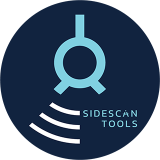

# SidescanTools

Welcome to SidescanTools, an open-source software to read and   

process data from side-scan sonar instruments.   
This tool can be used to create high-resolution 2D images of the sea floor.
The data can be processed to reduce noise, apply slant-range correction and gain normalisation on a set of side-scan files.
They can then be exported as `.geotiff` or simple `.png` files.
As of now, SidescanTools can process and read data from two formats:
- .jsf: open file format by EdgeTech
- .xtf: cross-platform readable file format

# Main Processing Steps
1. Detect **bottom line** in waterfall view (required for any following processing step).
2. **Geometric Corrections**: Slant-range correction: Calculate ground range by projecting slant ranges onto bottom, assuming flat seafloor.
3. **Radiometric Corrections**:
- Filter stripe noise using a Filter in 2DFFT domain
- Apply a sharpening filter 
- Apply one of two **Gain Normalization** Strategies:

  - Beam Angle Correction (BAC, works on a single file)
  - Empirical Gain Normalization (EGN, works by analyzing all files in the project)

   Note: EGN needs quite some data for good performance. If only few data exist, use BAC!
   BAC sums & averages intensities per beam angle over all pings in a file. 
   EGN sums and averages amplitudes of all pings by beam angle and distance over all loaded files to correct for intensity.
   Note that this only works for files from the *same* instrument.
   A good approach is one EGN table per survey/day and per instrument.

4. **View and Export**
  - View data of the different steps in napari to examine procesing results.
  - Export data as **georeferenced image** to view on a map.
  - If only a simple image is needed, a waterfall image can also be exported.

# Issues and Planned Features
The following features are still under development and will be improved in future releases:
- **Georeferencing** currently uses [gdal v3.11](https://gdal.org/) and `homography` or `polynomial 1` as warping algortihm along with ground control points. Usually, homography is more precise but can in some cases produce wavy structures and/or shifts in the data. In this case, use `Polynomial` (preserves parallel lines) -- _custom georeferencing to be implemented_
- _Implement a standard case per possible imported datatype for **optimal visibility of objects** in the images_
- **Bottom line detection** sometimes failes, especially when there are a lot of reflections in the water coloumn. Therefore a strategy to counter this should be examined.

# Getting Started
1. Currently we use Anaconda/Miniconda for platform indepent installation using Python 3.12. This is preferred because the installation of GDAL is essential and often doesn't work using pip. 
2. Clone this git repository
3. Install required packages from `environment.yml`: `conda env create -f environment.yml`
   Using a virtual (conda!) environment is recommended.
   Currently packages are listed without minimum version.
4. Start GUI by executing `python main.py`

# Usage
The tool works based on a project directory, which can be set via the `Working directory` button. 
Pressing `Save Project Info` will save all settings and information about the imported files to this directory where it then can be loaded from.
In the following all GUI elements are explained in more detail.

## Add Sidescan Data
- Add sidescan data by pressing `Add XTF/JSF` in the top left panel
- The data is imported into the current project and it is checked whether the data can be interpreted

## Bottom Line Detection (BLD)
- `Bottomline Detection` initiates the bottom-line detection window
- `Chunk Size`: Number of pings in a single view
- `Default Threshold`: Threshold used on normalized ping data to make data binary for bottom detection
- `Downsampling Factor`: Integer number to reduce samples per each ping (Data is decimated using this factor)
- `Convert to dB`: Convert data to decibels instead of raw intensities
- `Apply Contrast Limited Adaptive Histogram Equalization`: Apply CLAHE to the data to improve contrast

### Interactive BLD
- The selected file is read and divided into chunks.
  An initial depth detection is done for the full file which can be adjusted for each frame/chunk.
- Threshold and side strategies that can be selected: `Each Side Individually`, `Combine Both Sides`, `Only Use Portside`, `Only Use Starboard`
- The depth detection result can be saved or loaded to a `.npz` file.
  Files need so be saved to the current working directory to be accessible for the next processing steps.
  - `Chunk Size`: Number of pings per chunk to visualise in bottom detection window
  - `Apply Downsampling`: Use downsampling factor as defined in bottom line detection. If unchecked, data will only be downsampled for bottom line detection but not for final image/geotiff generation.

## Processing
### Noise Reduction and Sharpening Filter
- `Filter Stripe Noise (experimental)`: A 2D FFT based filter is applied to remove the horizontal stripes that often occur in sidescan images.
- `Apply Sharpening Filter (experimental)`: A homomorphic filter is applied to amplify the high frequency information.

### Slant Range Correction and Gain Normalisation
- `Apply Downsampling`: Use downsampling factor as defined in bottom line detection. If unchecked, data will only be downsampled for bottom line detection but not for final image/geotiff generation.
- `Apply Gain Normalisation`: Apply BAC or EGN to the data.
- `Vertical Beam Angle` (only relevant if internal depth is unknown or shall be omitted): Horizontal angle by which the instrument is tilted (usually found in the manual)
- Tick `Use Internal Depth` if the flying altitude of the side scan instrument is known & has been logged correctly

### Advanced Gain Normalisation Filter
- `Nadir Angle` (only relevant if internal depth is unknown or shall be omitted): Angle between perpendicular and first bottom return (usually need to be estimated, leave 0° if unsure)
- `Chunk Size`: Number of pings per chunk to calculate EGN table and use for waterfall image generation
- `Generate EGN table`: Initiates EGN table generation. All files loaded in the project that have bottom line information available will be processed. For each sonar file, the required information is saved to individual EGN info files. In a last step, all these info files are combined into one EGN table that can be applied to gain normalise all data of this side scan sonar type (see next step). This process needs quite some time (check console outputs).
- `Process All Files`: Applies previously calculated slant range correction & EGN to all loaded files at once. This will take some time depending on the amount of data (check console outputs).

## View and Export
### View Results
- Tick the `Reprocess File` option to apply slant range correction and EGN only to the selected file when viewing the results.
- `Convert to dB`: Convert data to decibels instead of raw intensities
- `Apply Contrast Limited Adaptive Histogram Equalization`: Apply CLAHE to the data to improve contrast
- `View Processed Data`: Initiates data viewer to inspect the raw input data, bottom line detection, slant range and EGN corrected data of the currently selected file.

### Georeferencing and image generation
- Tick `Use processed Data` if above processing steps should be applied, otherwise a waterfall image based on the raw data will be created
- Warp Method: Set transformation method for output chunks. Leave `Polynomial 1` if unsure - Sometimes, if e.g. vessel movement is irregular, the polynomial tranformation type works more reliable. If in doubt, compare geotiff with the (ungeoreferenced) waterfall image. Find more infos at [gdal] (https://gdal.org/en/stable/programs/gdal_raster_reproject.html)
- Resampling Method: Set resampling method for output chunks. Find more infos at [gdal] (https://gdal.org/en/stable/programs/gdal_raster_reproject.html)
- Resolution Mode: Set output file resolution. Find more infos at [gdal] (https://gdal.org/en/stable/programs/gdal_raster_mosaic.html)
- `Dynamic Chunking` chooses number of pings within one chunk for georeferencing based on distance between GPS points. Only apply when GPS data are bad! If unticked, chunk size is 5 pings.
- Untick `UTM` if you prefer WGS84 (unprojected) 
- `Apply Custom Colormap`: Select from a range of colormaps; if unticked, greyscale values are used
- `Generate Geotiff`: Uses gdal reproject (with either homography or polynomial order 1) and ground control points (gcps) to georeference data chunk wise and export as Geotiff
- `Include raw data in waterfall image`: produces additional png with raw undprocessed data
- `Generate Waterfall Image`: Generates a non-georeferenced png file from processed data. Adjust chunk size if you need one file instead of several.

# About
SidescanTools is an open-source software project by [GEOMAR](https://www.geomar.de/ghostnetbusters) and [sonoware](https://www.sonoware.de/news/2024-12-06_uebergabe_foerderbescheid/) funded by the AI Fund of the State of Schleswig-Holstein. The logo design and artwork has been done by Aili Xue.
