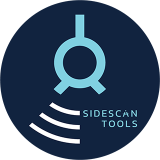
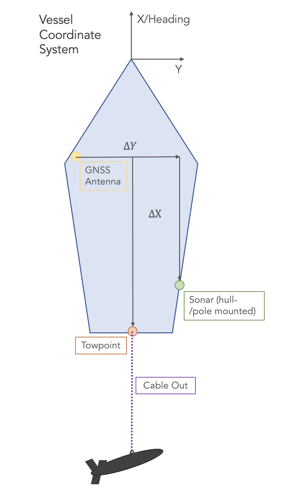

# SidescanTools

SidescanTools is an open-source software to read and <br />

process data from side-scan sonar instruments. <br />
This tool can be used to create high-resolution 2D images of the sea floor.
The data can be processed to reduce noise, apply slant-range correction and gain normalisation on a set of side-scan files.
They can then be exported as `.geotiff` or simple `.png` files.
As of now, SidescanTools can process and read data from the following formats:
- .jsf: open file format by EdgeTech
- .xtf: cross-platform readable file format

# Sidescan Processing Overview
The main processing steps of SidescanTools are:
1. [**Bottom-line Detection**](#bottom-line-detection-bld), automatic or assisted using waterfall view
2. **Slant-range Correction**: A geometric correction to calculate the ground range by projecting slant ranges onto the seafloor, which is assumed to be flat
3. **Radiometric Corrections**:
   - Filter stripe noise using a 2D-FFT filter
   - Apply sharpening filter
   - Apply one of two **Gain Normalization** Strategies:

     - Beam Angle Correction (BAC): Average intensities **per beam angle** over all pings in a single file
     - Empirical Gain Normalization (EGN): Average intensities **per beam angle and distance** over all pings of all loaded files

   **_Notes_**:
     - EGN needs quite some data for good performance. If only few data exist, please use BAC instead.
     - EGN only works for files created using the *same* instrument.
       A good approach is one EGN table per survey/day and per instrument.

4. **View and Export**
   - View data of the different steps in [napari](https://napari.org/) to examine procesing results
   - Export data as **georeferenced image** to view on a map
   - If only a simple image is needed, a waterfall image can also be exported

# Getting Started
* SidescanTools may be used with **full feature extent** as [graphical tool](#gui-usage) (GUI)
* You may also use the [**command-line interface**](#cli-usage) (CLI) for (batch) processing of data with altitude information

<!-- Uncomment the following when the conda package is built: -->
<!-- 1. Preferably create a new conda environment
2. In this environment, install the conda package via: `conda install conda-forge::sidescantools`
3. Start SidescanTools GUI: `sidescantools_gui` or CLI: `sidescantools_cli`

Otherwise, you can execute the source code by the following steps (they apply to both variants): -->
1. Clone this git repository
2. Install required packages in a new environment:
   - For GUI, use `environment.yml`: `conda env create -f environment.yml`
   - For CLI, use `environment_cli.yml`: `conda env create -f environment_cli.yml`

   We recommend to use Anaconda/Miniconda for platform-independent installation to ensure GDAL and other dependencies are installed correctly.

3. In the virtual environment, install the package locally via pip: `pip install -e .`
4. Start the GUI: `python src/sidescantools/main_gui.py` \
 or CLI: `python src/sidescantools/main_cli.py file_or_folder_path project_info.yml`

# GUI Usage
The GUI tool works based on a project directory, which can be set via the `Working directory` button.
Pressing `Save Project Info` will save all settings and information about the imported files to this directory where it then can be loaded from.
In the following all GUI elements are explained in more detail.

## Add Sidescan Data
- Add sidescan data by pressing `Add XTF/JSF` in the top left panel
- The data is imported into the current project and it is checked whether the data can be interpreted

## Bottom Line Detection (BLD)
- `Bottomline Detection` initiates the bottom-line detection window
- `Chunk Size`: Number of pings in a single view
- `Default Threshold`: Threshold used on normalized ping data to make data binary for bottom detection
- `Downsampling Factor`: Integer number to reduce samples per each ping (Data is decimated using this factor)
- `Convert to dB`: Convert data to decibels instead of raw intensities
- `Apply Contrast Limited Adaptive Histogram Equalization`: Apply CLAHE to the data to improve contrast

### Interactive BLD
- The selected file is read and divided into chunks.
  An initial depth detection is done for the full file which can be adjusted for each frame/chunk.
- Threshold and side strategies that can be selected: `Each Side Individually`, `Combine Both Sides`, `Only Use Portside`, `Only Use Starboard`
- The depth detection result can be saved or loaded to a `.npz` file.
  Files need so be saved to the current working directory to be accessible for the next processing steps.
  - `Chunk Size`: Number of pings per chunk to visualise in bottom detection window
  - `Apply Downsampling`: Use downsampling factor as defined in bottom line detection. If unchecked, data will only be downsampled for bottom line detection but not for final image/geotiff generation.

## Processing
### Noise Reduction and Sharpening Filter
- `Filter Stripe Noise (experimental)`: A 2D FFT based filter is applied to remove the horizontal stripes that often occur in sidescan images.
- `Apply Sharpening Filter (experimental)`: A homomorphic filter is applied to amplify the high frequency information.

### Slant Range Correction and Gain Normalisation
- `Apply Downsampling`: Use downsampling factor as defined in bottom line detection. If unchecked, data will only be downsampled for bottom line detection but not for final image/geotiff generation.
- `Apply Gain Normalisation`: Apply BAC or EGN to the data.
- `Vertical Beam Angle`: Angle in the vertical plane that the sound waves cover(usually found in the manual)
- Tick `Use Internal Altitude` if the flying altitude of the side scan instrument is known & has been logged correctly. This information is used for Slant Range Correction instead of an additional bottom line

### Advanced Gain Normalisation Filter
- `Nadir Angle`: Angle between perpendicular and first bottom return (usually needs to be estimated, leave 0° if unsure)
- `Chunk Size`: Number of pings per chunk to calculate EGN table and use for waterfall image generation
- `Generate EGN table`: Initiates EGN table generation. All files loaded in the project that have bottom line information available will be processed. For each sonar file, the required information is saved to individual EGN info files. In a last step, all these info files are combined into one EGN table that can be applied to gain normalise all data of this side scan sonar type (see next step). This process needs quite some time (check console outputs).
- `Process All Files`: Applies previously calculated slant range correction & EGN to all loaded files at once. This will take some time depending on the amount of data (check console outputs).

#### Parameters that are only exposed via `project_info.yml`
When using BAC or EGN for Gain Normalisation, the resolution of the estimated beam/beam and range pattern is usually fixed. It can be adjusted by these parameters:
- `BAC resolution`: Number of quantized values of the estimated beam pattern.
- `EGN table resolution parameters`: Two integer values. The first is the number of quantized values of the estimated beam pattern in angle direction. The second parameter is the range reduction factor. This defines by resolution in range direction of the resulting EGN table by dividing the ping length by this factor.

## View and Export
### View Results
- Tick the `Reprocess File` option to apply slant range correction and EGN only to the selected file when viewing the results.
- `Convert to dB`: Convert data to decibels instead of raw intensities
- `Apply Contrast Limited Adaptive Histogram Equalization`: Apply CLAHE to the data to improve contrast
- `View Processed Data`: Initiates data viewer to inspect the raw input data, bottom line detection, slant range and EGN corrected data of the currently selected file.




### Georeferencing and image generation
- Tick `Use processed Data` if above processing steps should be applied, otherwise a waterfall image based on the raw data will be created
- `Cable Out`: If the sonar has been towed behind and the **layback is not already in the raw data**, enter a cable out length. It will be used to calculate the layback assuming a rope angle of 45°.
- `X Offset`: Offset in X direction of vessel coordinate system between GNSS antenna position and sonar or winch suspension position. X is positive in forward direction from GNSS antenna position, i.e. negativ values indicate that sonar is installed behind GNSS antenna.
- `Y Offset`: Offset in Y direction of vessel coordinate system between GNSS antenna position and sonar or winch suspension position. Y is positive towards to right side of the vessel from GNSS antenna position, i.e. negativ values mean that sonar is installed left of GNSS antenna.
- `Resolution`: Set output file resolution. Currently, default is sample size which is probably too small.
- `Search Radius`: Set value to include <search_radius> neighbours for nearneighbour algorithm. Default: 2 * resolution. More info [here](https://www.pygmt.org/latest/api/generated/pygmt.nearneighbor.html)
- Use `Blockmedian` to reduce noise and data size. More info [here](https://www.pygmt.org/latest/api/generated/pygmt.blockmedian.html#pygmt.blockmedian)
- Untick `UTM` if you prefer WGS84 (unprojected)
- `Apply Custom Colormap`: Select from a range of colormaps; if unticked, greyscale values are used
- `Generate Geotiff for selected file`: Uses [pygmt: 0.17.0](https://www.pygmt.org/latest/index.html) with `blockmedian` (optional) and `nearneighbour` as gridding algortihm of xyz data (x/y: lon/lat, z: backscatter as amplitudes or greyscale). Use blockmedian to further noise and output grid size. Output raster if saved as 1-band geotiff with intensities as values.
- `Include raw data in waterfall image`: produces additional png with raw undprocessed data
- `Generate Waterfall Image`: Generates a non-georeferenced png file from processed data. Adjust chunk size if you need one file instead of several.

# CLI Usage
For batch processing, the CLI of SidescanTools can be used.
Therefore only the python packages defined in `environment_cli.yml` are required.

To process a file or a directory, use the following command:
```
python main_cli.py file_or_folder_path project_info.yml
```

This command processes the specified file or all files within the folder, using the settings defined in the provided `project_info.yml` file.

## Output
The tool produces:

- A **fully processed waterfall image** (.png format) stored in the same folder as the input data.
- A **GeoTIFF** of the processed data, saved in a separate folder as specified in `project_info.yml`.

**_Note_**: This workflow is intended for datasets where the sensor altitude is known during acquisition. This altitude information is used and refined during processing.

- **Mandatory Arguments**:
  - `file_or_folder_path`:

    Path to a single `.xtf` or `.jsf` file, or a folder containing multiple such files.
  - `project_info.yml`:

    Path to the CFG file.

- **optional flags**:
  - `-w`: **Write default CFG**:

    This option expects only one path to a valid directory as argument. A default CFG is written as `project_info.yml` to the given directory.
  - `-g`: **Generate EGN Table**

    This option generates an EGN table by analyzing all sidescan files in the provided `file_or_folder_path`. The result is written to a numpy file `egn_table_<timestamp>.npz` containing all info for SidescanTools to use this table for later EGN processing of these or other files.

    To use this EGN table you need to adjust the `EGN table path` in your `project_info.yml` to point to the latest generated EGN table (and have EGN gain normalisation enabled by setting `Slant gain norm strategy` to `1`).
  - `-n`: **No GeoTiff**

    Skips GeoTIFF generation and only creates the .png image(s).

## Parameter reference
In the following the most important CFG parameters of  `project_info.yml` which are relevant for processing with the CLI variant are explained.
The config is generated by a pydantic model and comes with a schema file (`project_info_schema.json`) that can be used for further information.

- `Active bottom line refinement`

  If `true`, use the internal primary sensor altitude information to find the bottom line in an area around the known altitude.
  This bottom line is found via an edge detection algorithm and its result can be used in two different ways, see [`Active btm refinement shift by offset`](#btm_refinement_shift).

- `Active bottom line smoothing`: If `true`, smooth detected bottom line.

- <a name="btm_refinement_shift"></a>`Active btm refinement shift by offset`

  This parameter only has effect when `Active bottom line refinement` is `true`.
  The mean distance of the raw altitude and the detected bottom line is calculated.
  If this parameter is `true`, the raw altitude information is shifted by this value and the result is used in the following as bottom line.
  Otherwise the result of the edge detection itself is used as bottom line.

- `Active convert dB`: If `true`, convert data to decibels instead of raw intensities.

- `Active hist equal`: If `true`, apply CLAHE (Contrast Limited Adaptive Histogram Equalization) to the data to improve contrast.

- `Active pie slice filter`: If `true`, a 2D-FFT based filter is applied to remove the horizontal stripes that often occur in sidescan images.

- `Active sharpening filter`: If `true`, a homomorphic filter is applied to amplify the high-frequency information. This feature is highly experimental and currently not advised.

- `Additional bottom line inset`: Offset in integer (default: 0). Move the bottom line by this amount inwards. May be useful to exclude remaining samples of the watercolumn, but should usually not be needed.

- `Bottom line refinement search range`: Fraction in float (default: 0.06). Defines the range around the sensor altitude which is used for the bottom line refinement.

- `EGN table path`: Path to the EGN Table which is used for gain normalisation.

- `Georef dir`: Directory which is used by the georeferencing to hold interim files and where the resulting GeoTIFFs are saved.

- `Slant gain norm strategy`: Enum,

  * When set to `0`, BAC is used for gain normalisation.
  * When set to `1`, EGN is used for gain normalisation.

- `Slant nadir angle`: Degrees as integer. Angle between perpendicular and first bottom return (usually needs to be estimated, leave `0` if unsure)

- `Slant vertical beam angle`: Degrees as integer. Angle in the vertical plane that the sound waves cover (usually found in the manual)

# About
SidescanTools is an open-source software project by [GEOMAR](https://www.geomar.de/ghostnetbusters) and [sonoware](https://www.sonoware.de/news/2024-12-06_uebergabe_foerderbescheid/) funded by the AI Fund of the State of Schleswig-Holstein. The logo design and artwork has been done by [Aili Xue](https://ailixue2025.myportfolio.com/logos).

# Support
If you are having any problems or questions when using SidescanTools or encounter any bugs, don't hesitate to contact us by opening an Issue.

# Extensions and Commercial Support
Commercial support, including the development of custom extensions and additional features, is available upon request. Please contact us at sidescantools (at) sonoware.de if you are interested in professional assistance or would like to collaborate with us.
